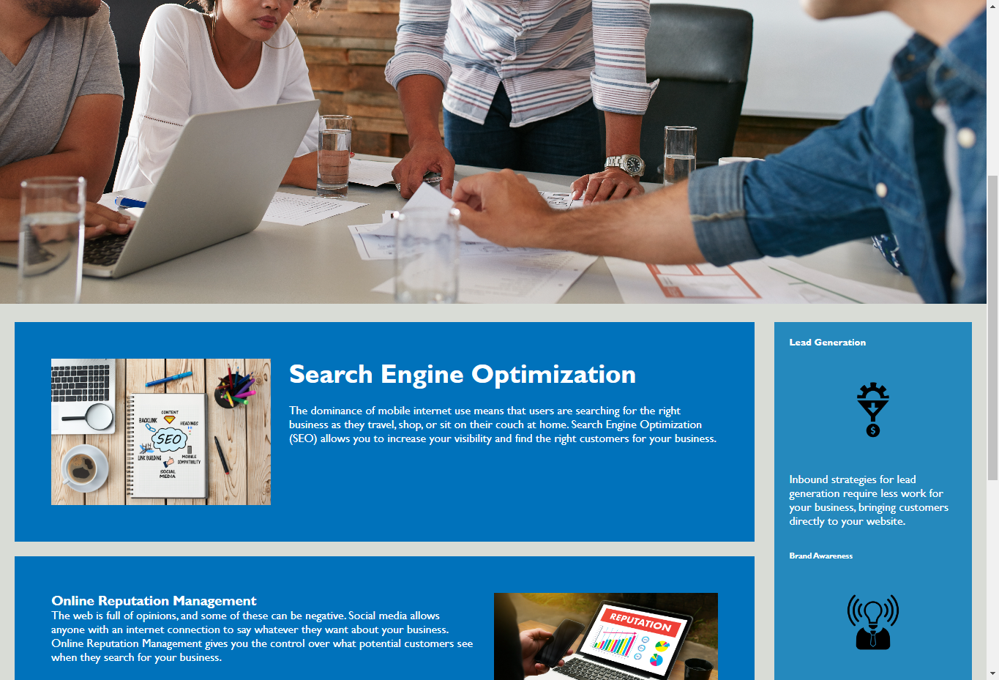

# FirstChallenge
## Description

The purpose of the project is that website will meet accessibility standards, so that website is optimzed for search engines.

To reach the mentioned goal we will make the following changes :

1. Semantic HTML elements can be found throughout the source code

2. HTML elements follow a logical structure independent of styling and positioning

3. Image and icon elements contain accessible alt attributes

4. Heading attributes fall in sequential order

5. Title elements contain a concise, descriptive title

## Screenshot

## Link to deployed application
https://sandradeve.github.io/FirstChallenge/
## Table of Contents
N/A
## Instalation
N/A
## Usage
N/A
## Credits
N/A
## Licence
N/A